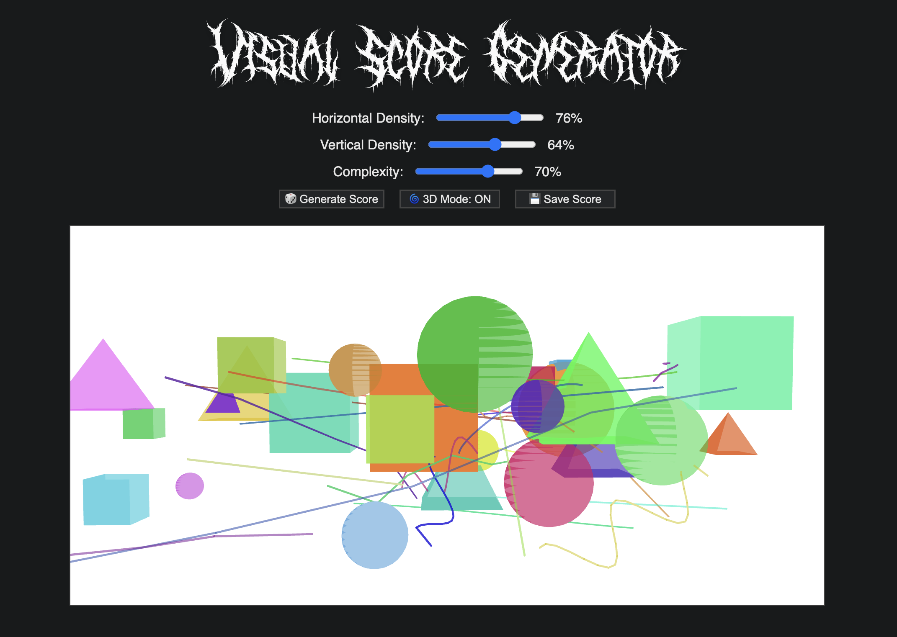

# Visual Score Generator

A procedural visual score generator for musicians and composers.  
Randomize primitive shapes and tweak the score's overall complexity, horizontal and vertical density to produce unique graphic scores for musical interpretation.  
Switch between 2D and 3D modes to play around with perspective and spatial information.

## Features

- **Procedural Generation:** Randomly generates visual scores using primitive shapes.
- **2D & 3D Modes:** Toggle between flat and spatial representations.
- **Live Mode:** Shapes gently animate for a dynamic score.
- **Customizable:** Adjust complexity, horizontal density, and vertical density.
- **Mobile Friendly:** Responsive UI, landscape controls toggle, and dark mode support.
- **Save & Share:** Download your score as a PNG.
- **Interpretation Key:** A example interpretation of how the tool could be used to inform the songwriting process.

## Credits

- **Font:** DeathMohawk (see `assets/fonts/`)
- **Powered by:** [p5.js](https://p5js.org/)